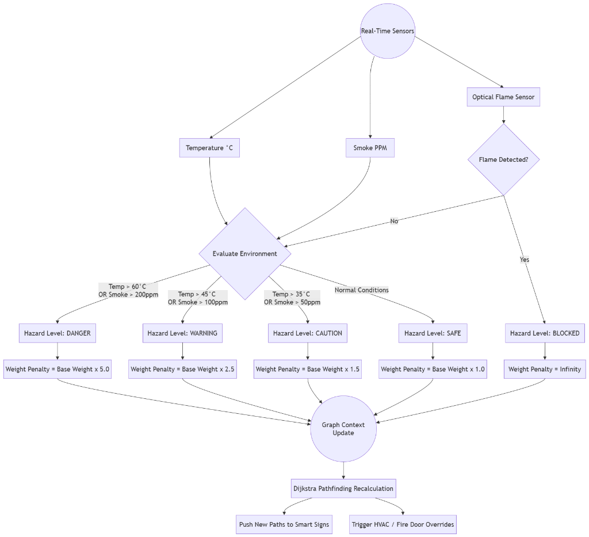
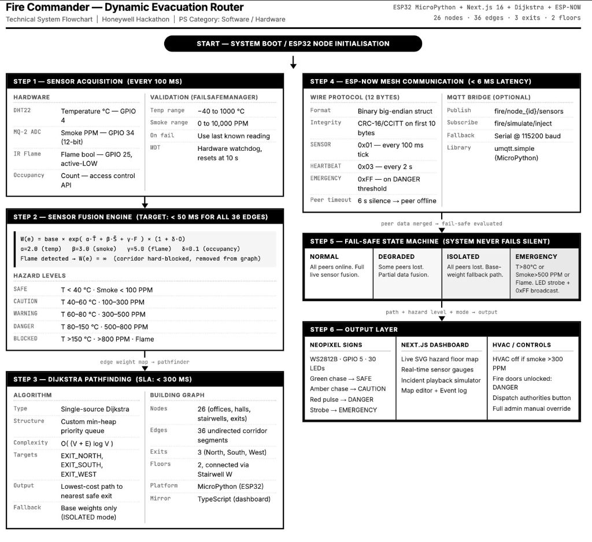

# Engineering Report: Dynamic Sensor-Fusion Routing

## 1. System Overview
Fire Commander utilizes a centralized graph-based network where hallways and rooms are **Edges** and intersections/exits are **Nodes**. To route occupants safely during an emergency, the system employs **Dijkstra's Algorithm** to find the path of least resistance (lowest total weight).

Instead of relying on static distances, the system fuses real-time telemetry (Temperature, Smoke PPM, and Flame Detection) to dynamically penalize paths that are becoming dangerous. 

## 2. Sensor-Fusion Flowchart
The following flowchart illustrates the exact decision tree used to convert raw sensor data into actionable edge-weights for the pathfinding engine.

## 3. Mathematical Weighting Model
The traversal cost ($C$) of any given edge ($E$) is calculated dynamically using the base distance ($D$) and a hazard penalty multiplier ($P_h$).

$$ C_E = D_E \times P_h $$

### Hazard Penalties ($P_h$)
* **SAFE ($P_h = 1.0$)**: Normal walking speed. Occupants can traverse the area safely.
* **CAUTION ($P_h = 1.5$)**: Slight smoke or heat. Path is viable but less optimal.
* **WARNING ($P_h = 2.5$)**: Moderate smoke. Visibility is dropping. The algorithm will strongly prefer longer, clearer routes unless no other option exists.
* **DANGER ($P_h = 5.0$)**: Heavy smoke or dangerous heat. The algorithm will route occupants through this edge *only* as an absolute last resort to escape.
* **BLOCKED ($P_h = \infty$)**: Active flame detected. The edge is severed mathematically. The algorithm will drop this edge from the graph entirely.

## 4. Technical System Architecture

To fully grasp the scope of Fire Commander, we must look beyond the abstract mathematical model and examine the real-world hardware and software implementation. The system is designed as a highly distributed, fault-tolerant network of edge nodes communicating with a central command dashboard.

### Step 1: Sensor Acquisition
At the hardware level, each node (e.g., an ESP32 microcontroller) acquires environmental data every 100ms.
* **DHT22**: Reads ambient temperature.
* **MQ-2 ADC**: Reads smoke particulate in parts per million (PPM).
* **IR Flame Sensor**: Active-LOW binary detection of optical flames.
* **Failsafe Validation**: The `FailsafeManager` ensures readings are within plausible ranges (e.g., -40 to 1000 °C) and relies on a hardware watchdog that resets unresponsive sensors after 10 seconds.

### Step 2: Sensor Fusion Engine
The raw data is fused into a single hazard penalty using a sophisticated exponential weighting function designed to aggressively penalize severe environments while remaining tolerant of minor fluctuations. If the IR Flame sensor detects fire, the edge is immediately hard-blocked ($W(e) = \infty$) and removed from the active routing graph.

### Step 3: Dijkstra Pathfinding Core
The central pathfinding engine utilizes a single-source Dijkstra algorithm implemented with a custom min-heap priority queue. This guarantees an SLA of under 300ms for path recalculation across the entire building footprint, ensuring that dynamic route updates happen in real-time as the hazard spreads.

### Step 4 & 5: Mesh Communication and State Machine
Communication between hardware nodes and the central server is handled via a low-latency ESP-NOW mesh network (< 6ms latency) using a highly optimized 12-byte binary wire protocol. 

To ensure reliability during catastrophic infrastructure failure, the system operates on a rigorous Fail-Safe State Machine:
* **NORMAL**: All peers online, full sensor fusion routing.
* **DEGRADED / ISOLATED**: If nodes lose connection to the mesh, they fall back to static, pre-calculated base weights to route occupants blindly to the nearest exit without relying on the central server.
* **EMERGENCY**: If extreme conditions are met locally, the node automatically triggers an emergency strobe regardless of network connectivity.

### Step 6: The Output Layer
The final computed paths and hazard states are pushed to three distinct output channels simultaneously:
1. **Physical Smart Signs**: WS2812B Neopixel strips at corridor intersections display dynamic green chasing arrows pointing to safety, amber warnings, or red emergency pulses.
2. **Next.js Command Dashboard**: Administrators receive a live, SVG-rendered map of the building, real-time sensor gauges, and incident logs.
3. **Automated HVAC & Door Controls**: The system physically interfaces with the building's infrastructure—automatically suppressing HVAC ventilation in smoke-filled zones (to starve fires of oxygen) and unlocking electronic fire doors to prevent entrapment.

### Conclusion
Fire Commander represents a paradigm shift in emergency evacuation. By marrying low-latency edge hardware with an intelligent, centralized Next.js routing engine, it transforms passive building infrastructure into an active, life-saving guidance system.
