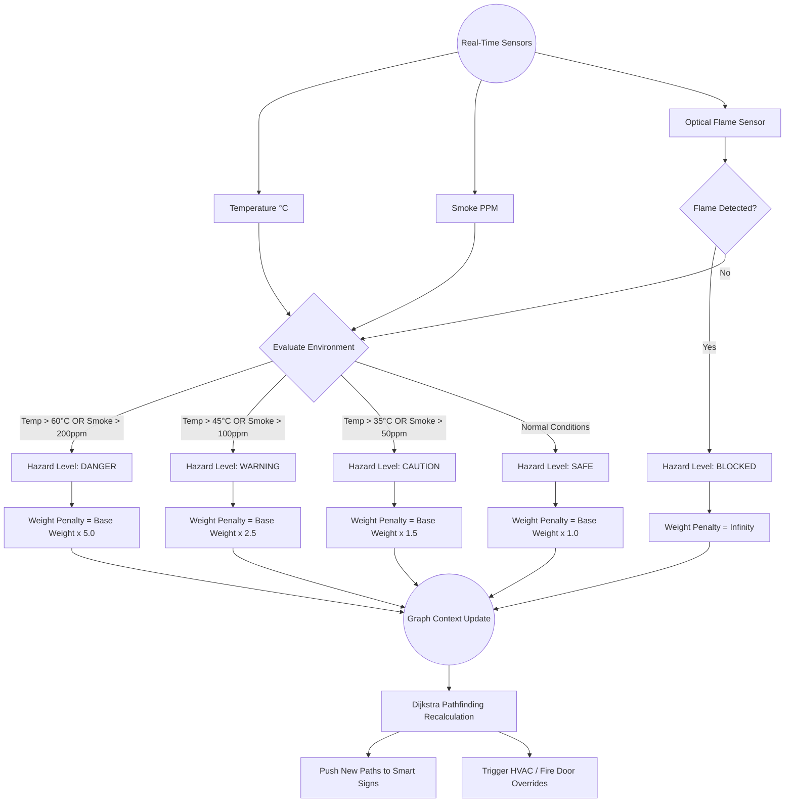

# Engineering Report: Dynamic Sensor-Fusion Routing

## 1. System Overview
Fire Commander utilizes a centralized graph-based network where hallways and rooms are **Edges** and intersections/exits are **Nodes**. To route occupants safely during an emergency, the system employs **Dijkstra's Algorithm** to find the path of least resistance (lowest total weight).

Instead of relying on static distances, the system fuses real-time telemetry (Temperature, Smoke PPM, and Flame Detection) to dynamically penalize paths that are becoming dangerous. 

## 2. Sensor-Fusion Flowchart
The following flowchart illustrates the exact decision tree used to convert raw sensor data into actionable edge-weights for the pathfinding engine.

## 3. Mathematical Weighting Model
The traversal cost ($C$) of any given edge ($E$) is calculated dynamically using the base distance ($D$) and a hazard penalty multiplier ($P_h$).

$$ C_E = D_E \times P_h $$

### Hazard Penalties ($P_h$)
* **SAFE ($P_h = 1.0$)**: Normal walking speed. Occupants can traverse the area safely.
* **CAUTION ($P_h = 1.5$)**: Slight smoke or heat. Path is viable but less optimal.
* **WARNING ($P_h = 2.5$)**: Moderate smoke. Visibility is dropping. The algorithm will strongly prefer longer, clearer routes unless no other option exists.
* **DANGER ($P_h = 5.0$)**: Heavy smoke or dangerous heat. The algorithm will route occupants through this edge *only* as an absolute last resort to escape.
* **BLOCKED ($P_h = \infty$)**: Active flame detected. The edge is severed mathematically. The algorithm will drop this edge from the graph entirely.

## 4. Real-World Scalability
This localized edge-weight calculation allows the system to scale massively. Because edge weights are only updated when a sensor in that specific zone crosses a threshold, the computational overhead is extremely low. The central server (or distributed edge nodes) only needs to re-run the Dijkstra algorithm on the graph when an edge's $P_h$ state actively changes.
